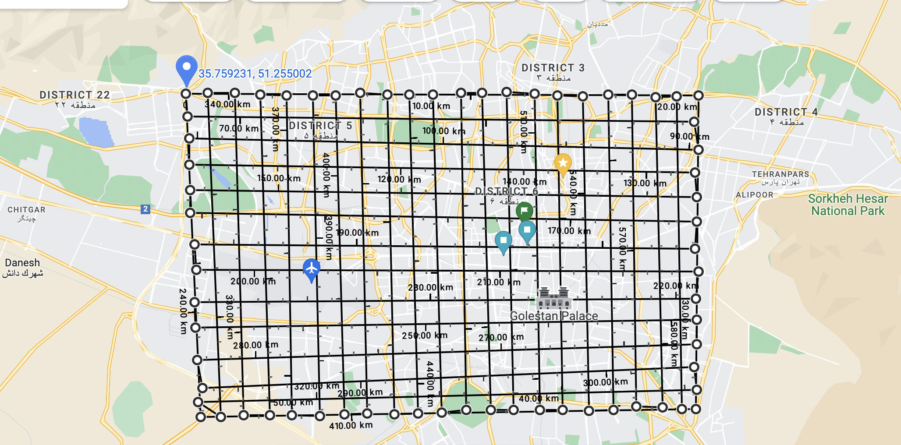

# Introduction

we want to estimate time during a trip between 2 points in a city
and our data are car's locations that are produced to kafka every 5 second's
.

its huge data so to solve this problem we divide city to 10000 points
and assign closet point to every record with its location and calculate
weight between points with spark aggregation and produce result to kafka

example tehran which is  divided to points 



# Install

```bash

sudo apt update -y
sudo apt install -y git python3 python3-pip python3-venv

git clone https://github.com/hoseinlook/road-traffic-graph.git

cp -n .env.example .env
nano .env

python3.8 -m venv venv
source venv/bin/activate
pip install -U pip
pip install -r requirements.txt

```

# Run

to run this project
at first provide infrastructure like kafka and zookeeper with docker

##### start kafka:

```bash
docker-compose up
```

+ kafka bootstrap host: [ localhost:9093 ]( localhost:9093 )
+ zookeeper server: [ localhost:2181 ]( localhost:2181 )

##### start pipeline:

now start pyspark pipeline

```bash
source venv/bin/activate
python -m pipeline
```

+ spark webUI: [ localhost:4040 ]( localhost:4040 )

##### produce example data to kafka:
```bash
source venv/bin/activate
python -m generate_data
```

####  Note:

you can watch checkpoint's and data of kafka and data of zookeeper in storage directory


## Optional
run spark in jupyter (its not streaming) to watch
```bash
jupyter-notebook .
```


